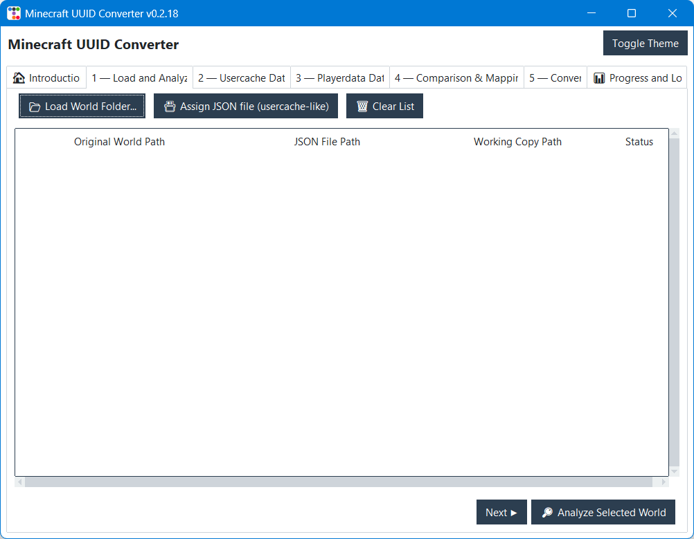
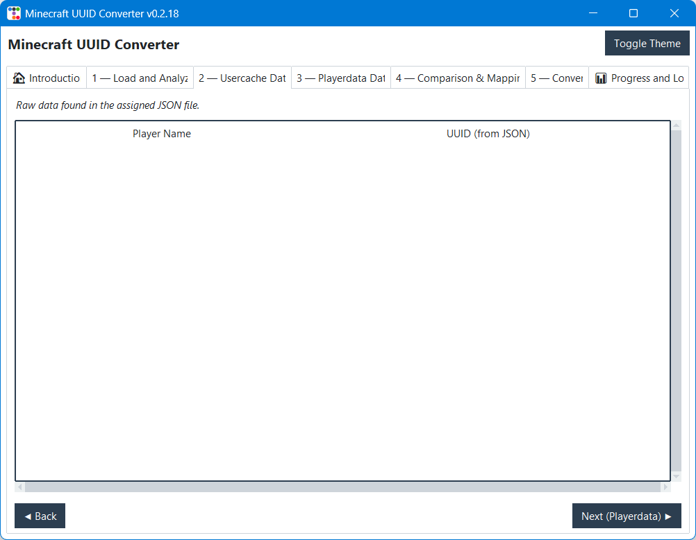
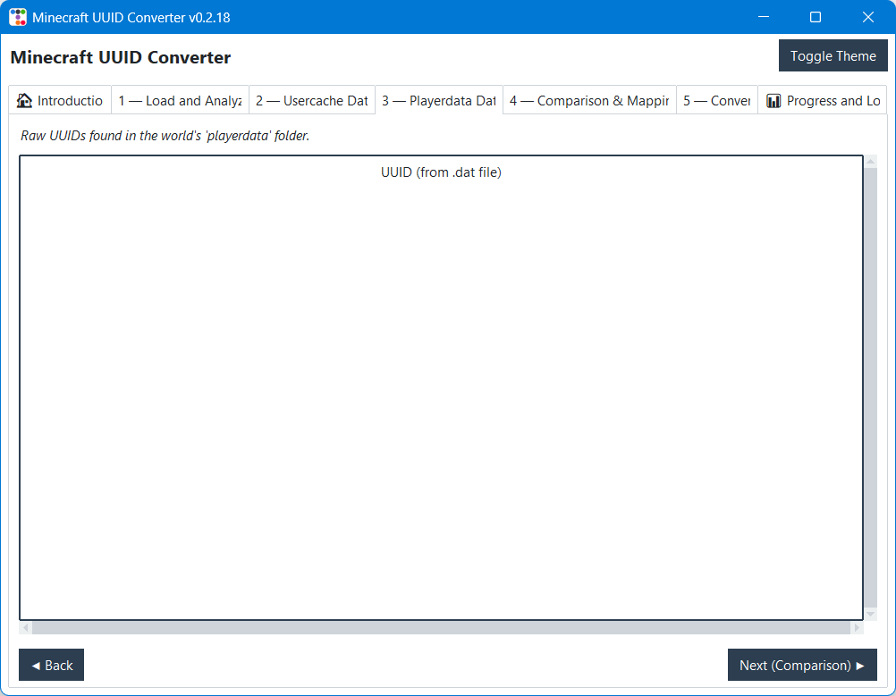
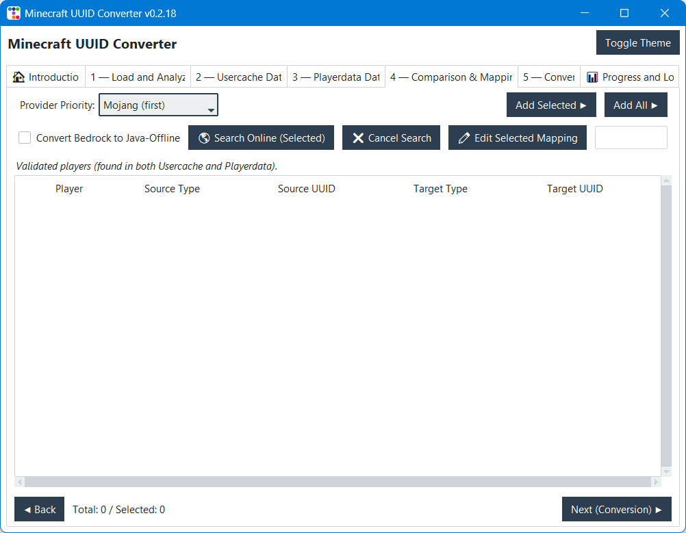

# ⛏️ Minecraft UUID Converter (GUI)

> **Una suite profesional de escritorio para migrar datos de jugadores (inventarios, estadísticas, logros y skins) entre diferentes tipos de UUID en servidores de Minecraft.**

**Minecraft UUID Converter** es una herramienta esencial para administradores de servidores. Permite realizar migraciones masivas y seguras de datos cuando un servidor cambia de modo (ej. Premium a No-Premium) o cuando se integran jugadores de Bedrock (GeyserMC) a Java. Todo esto a través de una interfaz gráfica moderna, rápida y segura.









## ✨ Características Principales

- **🔄 Conversión Bidireccional:** Soporta migraciones de Online (Premium) a Offline (Cracked), y resolución de conflictos entre cuentas de Java y Bedrock (Geyser).
- **🧠 Auto-Cálculo de UUIDs Offline:** El algoritmo integrado genera instantáneamente los UUIDs correctos para el modo "No-Premium" usando el estándar de Mojang (MD5 de `OfflinePlayer:Nombre`).
- **🛡️ Sistema de Backup Automático:** Nunca perderás datos. El script genera copias de seguridad (`.bak`) de los archivos originales antes de sobrescribirlos.
- **⚡ Multihilo (Anti-Congelamiento):** La interfaz gráfica nunca se congela. El análisis profundo y la conversión de archivos ocurren en segundo plano utilizando `QueueManager` y `Threading`.
- **📦 Auto-Instalador:** No requiere configuración compleja. Al ejecutar el programa por primera vez, detectará e instalará automáticamente las dependencias faltantes (`ttkbootstrap`, `requests`).

---

## ⚙️ Requisitos e Instalación

**Requisitos del sistema:**

- Python 3.8 o superior.
- Acceso a la carpeta del mundo del servidor (ej. `world/`) y al archivo `usercache.json`.

**Dependencias (gestionadas automáticamente):**

- `ttkbootstrap` (Para el tema moderno y oscuro).
- `requests` (Para consultas a la API de Mojang).

### Ejecución

```bash
python main.py
```

📖 Guía de Uso (Flujo de 5 Pasos)

La interfaz está dividida en pestañas que te guían paso a paso:

🏁 Intro & Mode: Selecciona el modo de conversión (ej. Online a Offline).

📂 World Selection: Carga la carpeta de tu mundo (ej. C:/servidor/world) y tu archivo usercache.json.

🔍 Usercache: Revisa la lista de jugadores detectados en la caché del servidor.

🗺️ UUID Mapping (El cerebro): Aquí verás el análisis. Selecciona los jugadores y usa el botón "Calculate Offline UUIDs" para que el script determine a qué archivos renombrar los datos.

🚀 Convert: Revisa el resumen final y presiona Start Conversion. Los archivos se copiarán con sus nuevos nombres instantáneamente.
📂 ¿Qué datos se convierten?

El script busca y renombra archivos de forma segura en las siguientes subcarpetas del mundo:

playerdata/ (Inventarios, posición, salud, Enderchest)

stats/ (Estadísticas de minado, muertes, tiempo de juego)

advancements/ (Logros desbloqueados)

skinrestorer/ (Datos del plugin de skins, si existe)
🏗️ Arquitectura del Código

El proyecto sigue una arquitectura modular y limpia para facilitar su mantenimiento:

main.py: Punto de entrada y configuración de DPI para Windows.

app.py: Controlador principal de la GUI.

logic.py: Motor de conversión de archivos (I/O).

queue_manager.py: Sistema de cola para actualizar la UI desde hilos de trabajo.

ui_builder.py / ui_components.py: Construcción de widgets y temas (Treeviews, Tabs).
⚖️ Licencia

Este proyecto es de uso libre para la comunidad de administradores de servidores de Minecraft.
